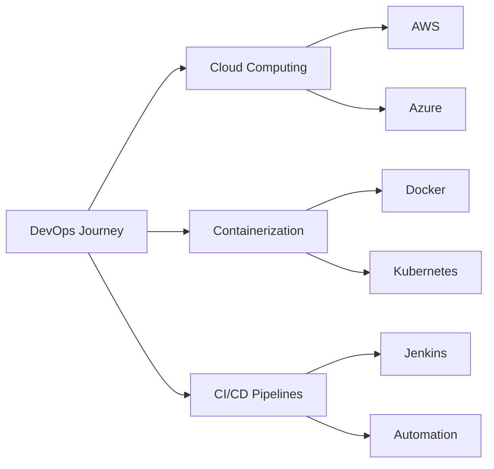

<div align="center">

# Hi there, I'm Ayomal Banneka 👋

### Undergraduate Full-Stack Software Engineer & Aspiring DevOps Engineer

[](https://www.linkedin.com/in/ayomalbanneka)
[](mailto:ayomalkaushalya@gmail.com)
[](https://github.com/ayomalbanneka)


</div>

---

## 🚀 About Me

```typescript
const ayomal = {
    location: "Anuradhapura, Sri Lanka 🇱🇰",
    education: "BSc Computer Software Engineering @ Birmingham City University",
    role: "Full-Stack Developer | DevOps Enthusiast",
    currentFocus: ["Cloud Computing (AWS/Azure)", "Containerization", "CI/CD Pipelines"],
    interests: ["Open Source", "Automation", "Scalable Systems"],
    funFact: "I once automated my entire morning routine with Python! ⚡"
};
```

I'm passionate about **bridging the gap between development and operations**, building scalable systems, and continuously improving deployment pipelines. Currently expanding my expertise in modern DevOps practices, cloud services, and automation tools.

---

## 🛠️ Tech Stack

<div align="center">

### Languages


### Frontend Development


### Backend & Databases


### DevOps & Cloud


### Tools & Technologies


</div>

---

## 📚 Certifications & Learning

<table>
<tr>
<td width="50%">

🐳 **Docker for Absolute Beginners with Hands-on Projects**

🐍 **Python for Beginners**

☁️ **KodeKloud Engineer - 100 Days of Cloud (AWS) Level 1**

</td>
<td width="50%">

🔧 **Introduction to Jenkins (LFS167)**

🐧 **Introduction to Linux (LFS101)**

📈 **Continuous Integration & Version Control**

</td>
</tr>
</table>

---

## 💼 Featured Projects

<div align="center">

### 🗂️ Inventory Management System
[](https://github.com/ayomalbanneka/Inventory-Management-System)
[](https://github.com/ayomalbanneka/Inventory-Management-System)

A comprehensive Java-based inventory management system providing tools for managing products, stock, and business operations with modular architecture.

**Key Features:** Product Management | Stock Control | Business Operations | Modular Design

[📂 View Repository](https://github.com/ayomalbanneka/Inventory-Management-System)

</div>

---

## 🎯 Current Focus



- 🔭 Working on: **Building scalable cloud-native applications**
- 🌱 Learning: **Advanced Kubernetes, AWS Solutions Architecture**
- 👯 Looking to collaborate on: **Open source DevOps tools & cloud projects**
- 💬 Ask me about: **Full-stack development, Docker, CI/CD, AWS**
- ⚡ Goal: **Become a proficient DevOps Engineer specializing in cloud infrastructure**

---

## 🏆 Skills Overview

<div align="center">

| Category | Skills |
|----------|--------|
| **Cloud Platforms** | AWS, Azure (Learning) |
| **Containerization** | Docker, Kubernetes |
| **CI/CD** | Jenkins, Git, Version Control |
| **Programming** | Python, Java, JavaScript, PHP |
| **Web Development** | HTML5, CSS3, Bootstrap, MySQL |
| **Operating Systems** | Linux, Windows |
| **Tools** | VS Code, IntelliJ IDEA, Postman, NetBeans |

</div>

---

## 📫 Let's Connect!

<div align="center">

I'm always open to interesting conversations, collaboration opportunities, and new challenges!

[](https://www.linkedin.com/in/ayomalbanneka)
[](mailto:ayomalkaushalya@gmail.com)

</div>

---

<div align="center">

### 💭 Quote of the Day


---

⭐ **Thanks for visiting! Feel free to explore my repositories and star what you find interesting!** ⭐


**Last Updated:** February 2026

</div>
